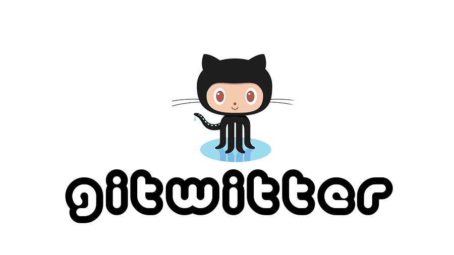

  

  ### APLICAÇÃO CLONANDO ALGUMAS FUNCIONALIDADES DO TWITTER EXCLUSIVA PARA USUÁRIOS GITHUB

  
  
  

 

Esse projeto trata-se de uma solicitação feita por uma empresa para avaliar os 
meus conhecimento.  
Trata-se de uma aplicação semelhante ao Twitter feita exclusivamente para os usuários do Github

## Recursos

- **Express** — Framework nodeJS
- **MongoDB** — Banco de dados não relacional para armazenar os registros da aplicação
- **Mongoose** — ORM do MongoDB para manipular o banco de dados direto pelo Jaascript
- **Axios** — Pacote que intermedia a conexão com api's externas
- **Crypto** - Biblioteca do próprio node que gera caracteres aleatórios para serem utilizados como id's dos registros no base de dados
- **BcryptJs** - Encriptador utilizado para codificar a senha du usuário na base durante o cadastro. Uma ferramente de segurança caso o banco de dados seja invadido
- **JasonWebToken** - Biblioteca que gera um token de autenticação para garantir que operações restritas só sejam realizadas por quem está realmente logado
- **Yup** - Biblioteca de validação de dados para cadastro ou atualização de usuário

## Iniciando

1. Clone este  reposítório usando `git clone https://github.com/maykonsousa/betheherogitwitter.git`
2. acesse a pasta do projeto via terminal com o comando: `cd bethehero` 

>É necessário ter instalado o [NodeJS](https://nodejs.org/en/download/) e o [Yarn](https://yarnpkg.com/). Consulte formas de instalar nos sites oficiais

### Iniciando o Backend

1. Acesse a pasta do backend no terminal: `cd backend`
2. Utilize o comando  `yarn` para instalar todas as dependências necessárias 
3. Utilize o comando  `yarn start` para iniciar o servidor

para testar as funcionalidades do backend instale o [Insomnia](https://insomnia.rest/download/), em seguida clique no botão abaixo para importar as configurações do workspace

## EndPoints

### **POST / users**

Cadastro de usuários utilizando apenas o login do GitHub e a senha. Somente usuários do Github podem se cadastrar
  
### **GET / users**

Rota lista todos os usuários cadastrados na aplicação

### **PUT / users**

Permite ao usuário **LOGADO** atualizar a senha de acesso á aplicação. Como os outros dados são resgatados do GitHub, não é possível atualizar

### **DELETE / users**

Permite o usuário **LOGADO** excluir a própia conta. 

### **POST / posts**

Permite ao usuário logado, postar twitts
  
### **GET / posts**

Exibe todos os twitts de todos os usuários postados na aplicação

### **PUT / myposts**

Exibe todos os twitts que foram postados **PELO USUÁRIO LOGADO**.

### **DELETE / posts/:post_id**

Permite ao usuário logado excluir qualquer comentário em que **ELE SEJA O AUTOR**

### **POST / post/:post_id**

Permite ao usuário logado adicionár comentários a qualquer postagem da aplicação, inclusive às suas.

### **DELETE / posts/comments/:comment_id**

Permite ao usuário logado excluir qualquer comentário desde que **ELE SEJA O AUTOR DO POST OU DO COMENTÁRIO**

### **DELETE / posts/likes/:post_id**

Permite ao usuário logado dar "like" em qualquer twitt da aplicação

>a aplicação ainda tem funcionalidades que precisam ser implementadas e  tambem pretendo cosntruir a plataforma web em `ReactJS`

***

## CONTATOS
**LinkedIn**: [https://www.linkedin.com/in/maykonsousa](https://www.linkedin.com/in/maykonsousa/)  
**Site**: [https://maykonsousa.github.io](https://maykonsousa.github.io/)  
**Whatsapp**: [61 992943297](http://wa.me/5561992943297)